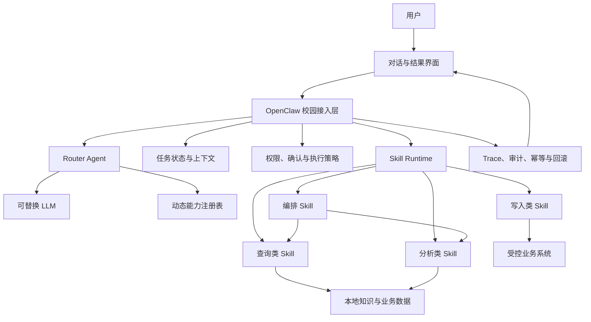
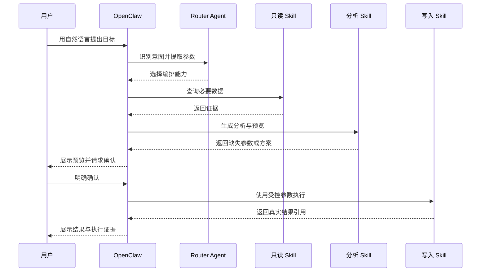

# OpenClaw 在智能校园场景中的应用与技术实践

> 文档版本：2.0
> 更新日期：2026-08-13
> 项目定位：OpenClaw Agent 能力扩展与校园场景验证 Demo

## 1. 项目定位

本项目的核心不是建设一个完整的学校门户，也不是提前模拟大量真实校园数据，而是验证 OpenClaw 作为通用 Agent 平台，在校园场景中能否形成一套可扩展、可控制、可观察的智能助手技术体系。

校园只是一个适合验证 Agent 能力的应用环境：它同时包含信息查询、复杂问题分析、多系统协作、持续对话、敏感写入和权限控制。项目使用少量本地 Demo 数据实现最小闭环，重点验证以下问题：

- OpenClaw 能否理解用户非模板化的自然语言；
- 能否根据任务动态选择不同 Skill；
- 能否把多个独立能力编排成完整任务；
- 能否基于本地知识完成可信的 Agentic Search；
- 能否在模型不稳定时继续可靠运行；
- 能否约束 Agent 的权限、写入、证据和执行边界；
- 能否让一次 Agent 执行被用户和运维人员理解、追踪和审计；
- 能否通过替换模型、数据源和 Skill，扩展到真实校园环境。

因此，本项目关注的是 OpenClaw 的能力框架和工程化方式。请假、选课、校园卡等内容只是示例 Skill，不代表项目最终只能用于这些业务。

## 2. 为什么校园场景适合 OpenClaw

传统校园信息系统通常按部门和业务拆分。用户需要知道应该进入哪个系统、找到哪个菜单、准备哪些材料以及按照什么顺序操作。普通聊天机器人虽然能回答 FAQ，但往往不能继续执行后续任务。

OpenClaw 的价值在于把“自然语言入口”和“可执行能力”连接起来：

```text
用户表达目标
→ Agent 理解意图
→ 选择或组合 Skill
→ 查询本地知识和业务数据
→ 发现缺少的信息并继续追问
→ 在必要时请求用户确认
→ 调用受控工具执行任务
→ 返回结果、来源和执行证据
```

这使校园助手可以从“回答问题”扩展为“协助完成任务”。

适合扩展的方向包括：

| 类型 | 可扩展示例 | OpenClaw 的作用 |
| --- | --- | --- |
| 校园信息服务 | 办事指南、规章制度、场馆开放、校园卡 | 理解复杂问题并进行可信检索 |
| 教学服务 | 课表、培养方案、选课建议、考试安排 | 组合规则、数据和个性化上下文 |
| 学生事务 | 请假、奖助、证明、宿舍服务 | 收集参数、生成预览、确认后执行 |
| 教师服务 | 调课、教室、学生名单、教学通知 | 调用多个系统完成工作流 |
| 管理服务 | 数据查询、异常汇总、流程提醒 | 编排工具并输出可审计结果 |
| 主动服务 | 截止提醒、课程冲突、材料缺失 | 根据状态和事件触发 Agent 任务 |

真实落地时不需要一次性建设所有场景。只要 OpenClaw 的 Skill 契约、权限模型和执行框架保持稳定，新能力可以逐步接入。

## 3. OpenClaw 在本项目中的角色

OpenClaw 位于用户界面和校园能力之间，主要承担四类职责。

### 3.1 自然语言理解

用户不需要按照固定模板输入。OpenClaw Router Agent 根据当前消息、会话状态和可用能力列表，识别：

- 用户希望完成什么任务；
- 当前是在开始任务、补充信息、确认、取消还是查询结果；
- 已经提供了哪些参数；
- 还缺少哪些信息；
- 应当使用哪个 Skill 或编排能力。

### 3.2 能力路由

OpenClaw 不依赖前端写死的按钮或关键词列表。服务启动时会扫描已启用 Skill，形成当前身份可使用的能力清单，再把这个清单提供给 Router Agent。

模型只能从服务端提供的能力 ID 中选择。即使模型生成了不存在或未授权的能力，服务端也会拒绝执行。

### 3.3 Skill 调用与编排

一个 Skill 对应一项边界清晰的能力，例如知识检索、课程查询或业务提交。复杂任务可以通过编排 Skill 顺序调用多个子能力。

OpenClaw 负责判断“要完成哪些步骤”，确定性服务负责判断“这些步骤是否允许执行以及如何执行”。

### 3.4 上下文管理

Agent 会话能够理解连续对话中的补充信息。例如用户第一次只说明目标，第二次补充时间，第三次确认提交，系统仍可以延续同一个任务。

上下文并不等于无限制保存聊天历史。本项目将任务状态独立持久化，并提供“新会话”功能，使聊天上下文、业务执行状态和审计记录相互分离。

## 4. 总体技术架构



该架构的关键不是让模型掌握所有逻辑，而是把不同职责分开：

- 模型负责语义理解和计划生成；
- OpenClaw 负责 Agent、会话和能力组织；
- 服务端负责权限、协议、状态和可靠性；
- Skill 负责可复用的单项能力；
- 知识库和业务系统负责提供事实与执行结果；
- Trace 和审计负责证明系统做过什么。

## 5. 动态 Skill 体系

### 5.1 Skill 是 OpenClaw 的能力扩展单元

如果所有功能都写进一个大提示词，模型会越来越难以理解边界，也无法对单项能力实施独立权限和测试。本项目将校园能力拆分为多个 Skill，并为每个 Skill 定义 Manifest。

Manifest 描述：

- 能力 ID、名称和版本；
- 允许使用的角色；
- 能力是只读还是写入；
- 写入前是否需要确认；
- 是否需要幂等和审计；
- 回滚方式和超时；
- 可执行 operations；
- 输入输出协议；
- 可以返回的结果卡片；
- 依赖的其他 Skill。

当前项目使用：

```text
<OPENCLAW_HOME>/workspace-campus/skills/*/capability.json
```

自动发现已启用 Skill。新增能力不需要修改前端能力数组，也不需要重新编写一套权限逻辑。

### 5.2 标准执行契约

新式 Skill 使用 JSON-stdio 信封：

```text
campus-skill-input@1
campus-skill-output@1
```

输入包含调用编号、身份角色、operation、结构化参数、确认状态和幂等键。输出包含执行状态、用户可读消息、结构化数据、卡片和证据引用。

Skill Runtime 会在脚本启动前检查：

1. Skill 和 operation 是否真实存在；
2. 当前身份是否拥有权限；
3. 写入是否已经明确确认；
4. 需要幂等的操作是否携带幂等键；
5. 入口是否位于允许的 Skill 目录；
6. 输出是否符合协议和卡片白名单。

这种方式使 Skill 可以由不同团队开发，同时保持统一的 OpenClaw 接入方式。

## 6. LLM 能力路由

### 6.1 路由输入

Router Agent 每轮接收：

- 当前时间；
- 用户消息；
- 当前未完成任务；
- 当前身份允许使用的能力；
- 固定的结构化输出协议。

### 6.2 路由输出

模型输出受约束 JSON：

```json
{
  "capabilityId": "campus.example",
  "confidence": 0.93,
  "intent": "start",
  "parameters": {},
  "missing": []
}
```

服务端再次验证能力 ID、置信度、字段长度、日期、时间和枚举。模型无法通过提示词自行扩大能力范围。

### 6.3 为什么不完全依赖模式匹配

模式匹配适合固定命令，但对省略、指代、上下文补充和复合意图效果有限。LLM Router 可以理解多种表达方式，并从连续对话中判断用户是在继续原任务还是开始新任务。

确定性规则仍然有价值，但更适合：

- 自动化测试；
- 模型不可用时的有限降级；
- 对高风险参数进行二次校验；
- 处理完全确定的系统指令。

## 7. 多 Skill 编排

单一 Skill 只能解决边界明确的问题。现实任务通常需要组合多个能力，例如先查询条件、再分析影响、生成预览、等待确认，最后执行写入。



编排能力本身尽量保持只读。真正的写入由独立写入 Skill 承担，从而复用该 Skill 的权限、确认、幂等、审计和回滚机制。

当前的请假课程影响流程只是这一技术模式的示例。相同模式可以用于证明办理、活动报名、设备报修、教师调课、场馆预约等任务。

## 8. 基于本地数据的 Agentic Search

### 8.1 从一次检索到检索 Agent

普通 RAG 通常执行“问题 → 检索 → 回答”。当用户一次提出多个相互关联的问题时，单次检索容易遗漏部分意图，也可能拿相邻知识强行回答。

Agentic Search 增加了一个受控规划过程：

```text
复杂问题
→ 拆分为可核验子问题
→ 为每个子问题生成本地检索词
→ 执行主查询
→ 判断证据是否真正支持该子问题
→ 仅对证据不足的子问题执行备用查询
→ 汇总已知事实与未知项
```

### 8.2 有界 Agent 设计

为了避免无限搜索、重复调用和成本失控，本项目限制：

- 每轮最多 3 个子问题；
- 每个子问题最多 1 个备用查询；
- 总计最多 5 次本地检索；
- 已获得有效证据的子问题立即停止搜索；
- 没有证据时明确返回未知，不允许模型补写。

### 8.3 事实边界

模型只负责生成检索计划，不负责提供校园事实。回答内容必须来自本地知识库中满足以下条件的条目：

- 条目已发布且在有效期内；
- 检索结果标记为可回答；
- 条目内容能够直接支持当前子问题；
- 回答保留知识条目 ID、来源、部门和更新时间；
- 本地没有证据时输出未知项。

这种结构可以在未来替换检索引擎、向量库或知识管理系统，而不改变 OpenClaw 的 Agent 交互方式。

## 9. 模型可替换与可靠性设计

### 9.1 模型不是系统可靠性的唯一来源

项目已经分别使用本地 Qwen 3.6 27B 和 GLM-5.2 验证路由与 Agentic Search。GLM 在严格结构化输出上表现更稳定，本地 Qwen 更符合未来私有化和成本控制目标。

真正落地时，系统不能假设任何模型永远返回合法 JSON。因此，OpenClaw 外围必须提供协议校验和降级机制。

### 9.2 Agentic Search 的三层规划策略

```text
第一次模型规划
  → 合法：直接执行
  → 非法：让同一模型只修复格式一次
      → 合法：执行修复后的计划
      → 仍非法、超时或不可用：使用确定性计划降级
```

系统会在执行状态和 Trace 中标明：

- 模型一次生成；
- 格式修复后采用；
- 确定性降级；
- 测试环境确定性模式。

降级只影响“如何生成查询计划”，不会放宽知识来源和权限边界。

### 9.3 模型分级的可能性

未来可以按任务复杂度分配模型：

- 简单意图和本地 FAQ：本地小模型；
- 复杂参数提取和多 Skill 编排：能力更强的本地模型；
- 复杂 Agentic Search：高结构化能力模型；
- 高风险写入：模型规划 + 确定性服务校验。

模型选择应由评测数据决定，而不是只比较主观回答效果。

## 10. Agent 的权限与执行边界

OpenClaw 可以规划任务，但不能直接获得无限工具权限。本项目采用以下边界：

- Agent 只看到当前身份允许使用的能力；
- Skill 声明读写模式和允许角色；
- 写入操作必须由服务端确认状态驱动；
- 模型不能指定任意脚本路径或操作系统命令；
- 模型不能自行创建前端组件或任意外部链接；
- 没有工具执行证据时，服务端会拦截“已经提交成功”等声明；
- 知识 Agent 不具备互联网搜索权限；
- 高风险回滚只开放给指定角色。

核心原则是：

> 模型可以提出计划，但权限、事实和副作用必须由确定性系统控制。

## 11. 任务状态与长期对话

Agent 的连续对话不能只依赖模型上下文窗口。项目使用独立状态机保存任务进度：

```text
collecting
awaiting-input
awaiting-confirmation
executing
succeeded
cancelled
failed
expired
```

状态以“可信身份 + 会话 ID”隔离，并保存能力、阶段、已确认参数和结果引用。服务重启后可以恢复未过期任务。

这种设计带来几个好处：

- 模型上下文被清理后，任务仍然可以恢复；
- 短跟进消息可以继续当前任务；
- 用户可以主动开启新会话；
- 已完成记录和审计不会因清除聊天而丢失；
- 任务过期后不会被旧上下文误触发。

## 12. 可观测性与执行证据

普通聊天机器人通常只展示最终回答，很难解释内部是否调用了模型、检索了哪些数据或执行了什么工具。本项目为 OpenClaw 增加脱敏 Trace：

- 请求开始与完成；
- Router Agent 调用；
- 能力选择来源；
- Skill 和工具开始、成功、失败及耗时；
- Agentic Search 采用的规划策略；
- 任务状态变化；
- 超时位置；
- 幂等结果是否被重放。

Trace 不保存聊天正文、完整身份、访问令牌、业务隐私字段或内部方案令牌。普通用户只能查看自己的执行过程，审计角色按授权查看跨身份记录。

前端通过“本次助手如何完成”展示这些事件。这不仅用于调试，也能提升用户对 Agent 行为的理解和信任。

## 13. 写入可靠性

虽然本项目重点是 OpenClaw，但一个能够执行任务的 Agent 必须处理副作用可靠性。

### 13.1 明确确认

分析结果和预览不会自动转化为写入。用户必须发送独立、明确的确认指令，服务端才能进入执行阶段。

### 13.2 幂等

写入请求使用幂等键。相同身份、请求内容和幂等键只执行一次；网络超时后使用原幂等键重试，不会产生重复记录。

### 13.3 审计

关键操作写入追加式哈希链，记录脱敏身份、动作、结果、耗时和前序哈希，用于检测普通篡改。正式环境可以通过 HMAC 和外部只追加存储进一步强化。

### 13.4 回滚与补偿

不同 Skill 可以声明不同回滚方式，例如用户取消、运营人员补偿或不支持自动回滚。Agent 不能自行扩大回滚权限。

这些能力让 OpenClaw 从“能调用工具”提升到“能够受控地调用工具”。

## 14. 用户界面在 OpenClaw 中的作用

校园门户只是 OpenClaw 的一个客户端。界面主要展示：

- 当前可用的动态 Skill；
- 自然语言对话；
- 任务当前阶段；
- 需要用户选择或确认的结构化卡片；
- 本地知识来源；
- Agent 的脱敏执行轨迹；
- 新会话入口。

相同的 OpenClaw 能力未来可以接入移动端、企业微信、飞书、校园 App 或服务大厅终端。只要客户端遵循统一 API 和卡片协议，不需要重写 Agent 与 Skill。

## 15. 当前验证结果

本项目目前已经验证：

- OpenClaw 能够根据动态能力列表进行 LLM 路由；
- 非模板化表达可以触发对应 Skill；
- 多轮对话可以补充参数并继续未完成任务；
- 多个 Skill 可以按顺序组成任务；
- 写入前确认、权限和幂等由服务端控制；
- 复杂问题可以执行本地 Agentic Search；
- 无证据内容不会使用模型记忆补充；
- 模型 JSON 错误可以修复一次并确定性降级；
- Qwen 与 GLM 可以在不修改 Skill 的情况下替换；
- 服务重启后任务状态和证据可以恢复；
- 用户可以看到脱敏的 Agent 执行过程；
- 25 项 Node.js 自动化测试与完整构建通过。

这些结果证明的不是某一项校园业务已经生产可用，而是 OpenClaw 在校园环境中具备从问答、检索到多步骤任务执行的技术可行性。

## 16. 从 Demo 到真实校园的演进路线

### 阶段一：Agent 能力验证

- 使用少量本地 Demo 数据；
- 建立 Router、Skill、编排和 Agentic Search；
- 固化权限、确认、幂等、Trace 和测试；
- 对比不同模型的路由和规划能力。

当前项目基本处于这一阶段末期。

### 阶段二：只读真实数据接入

- 接入学校统一身份；
- 接入课表、日程、场馆、通知和制度等只读数据；
- 建立正式知识发布、审核、版本和失效机制；
- 建立 Agent 评测集和灰度流量；
- 统计模型直出率、修复率、降级率和检索命中率。

### 阶段三：低风险业务执行

- 接入报修、预约、材料预审等低风险写入；
- 建立审批、幂等、回滚和人工接管；
- 为每个 Skill 定义 SLO、超时和错误处理策略；
- 对关键写入执行完整审计。

### 阶段四：校园级 Agent 平台

- 允许不同部门独立开发和发布 Skill；
- 建立统一能力目录和权限中心；
- 支持事件触发和主动服务；
- 建立模型分级路由和成本治理；
- 建立集中可观测、告警、评测和合规平台；
- 将 OpenClaw 作为多个校园终端共享的 Agent 中台。

## 17. 需要重点评测的指标

OpenClaw 项目不能只评测回答是否流畅，建议重点记录：

| 指标 | 说明 |
| --- | --- |
| 能力路由准确率 | 是否选择了正确 Skill |
| 参数提取准确率 | 日期、时间、类型等是否正确且未猜测 |
| 上下文延续准确率 | 补充消息是否继续正确任务 |
| 结构化输出合法率 | 模型输出能否直接通过协议校验 |
| 格式修复率 | 首次失败后能否修复成功 |
| 确定性降级率 | 模型不可用时进入兜底的比例 |
| 检索证据命中率 | 子问题是否获得真正支持它的证据 |
| 无证据乱答率 | 知识不足时是否发生模型补写 |
| 写入误触发率 | 未确认情况下是否触发副作用 |
| 幂等重复写入率 | 重试是否产生重复记录 |
| 端到端耗时 | 路由、规划、检索和执行的分层耗时 |
| 人工接管率 | Agent 无法完成时转人工的比例 |

这些指标可以决定是否需要更换模型、调整提示词、扩展知识库或优化 Skill，而不是依赖单次演示判断模型优劣。

## 18. 技术目录

OpenClaw 与 Agent 核心实现：

```text
<PROJECT_ROOT>/server/openclawRouter.ts
<PROJECT_ROOT>/server/agenticSearch.ts
<PROJECT_ROOT>/server/capabilityRegistry.ts
<PROJECT_ROOT>/server/skillRuntime.ts
<PROJECT_ROOT>/server/executionState.ts
<PROJECT_ROOT>/server/traceStore.ts
<PROJECT_ROOT>/server/campusAssistantPlugin.ts
```

OpenClaw 校园能力工作区：

```text
<OPENCLAW_HOME>/workspace-campus/skills
<OPENCLAW_HOME>/workspace-campus/knowledge
<OPENCLAW_HOME>/workspace-campus/data
<OPENCLAW_HOME>/workspace-campus-router
```

界面与 API 适配：

```text
<PROJECT_ROOT>/src/components/assistant/CampusAssistant.tsx
<PROJECT_ROOT>/src/services/campusApi.ts
```

测试与评测：

```text
<PROJECT_ROOT>/server/*.test.ts
<PROJECT_ROOT>/evals
```

## 19. 总结

本项目验证了一条比传统校园 FAQ 更完整的技术路线：以 OpenClaw 为 Agent 运行和能力组织平台，以 LLM 负责语义理解与计划生成，以 Skill 连接知识和业务能力，再通过确定性服务控制权限、事实、副作用和证据。

它的核心价值不在于当前演示了多少校园内容，而在于已经形成一套可继续扩展的技术基础：

- 能力可以动态增加；
- 模型可以替换；
- 多个 Skill 可以编排；
- 知识检索可以从 RAG 扩展为有界 Agentic Search；
- 模型失败不会直接导致系统失控；
- 写入行为可以确认、追踪、审计和回滚；
- 同一套 OpenClaw 能力可以服务多个用户终端。

在真实校园数据和系统逐步接入后，这套结构可以从当前 Demo 演进为面向学生、教师和管理人员的校园级智能助手平台。
