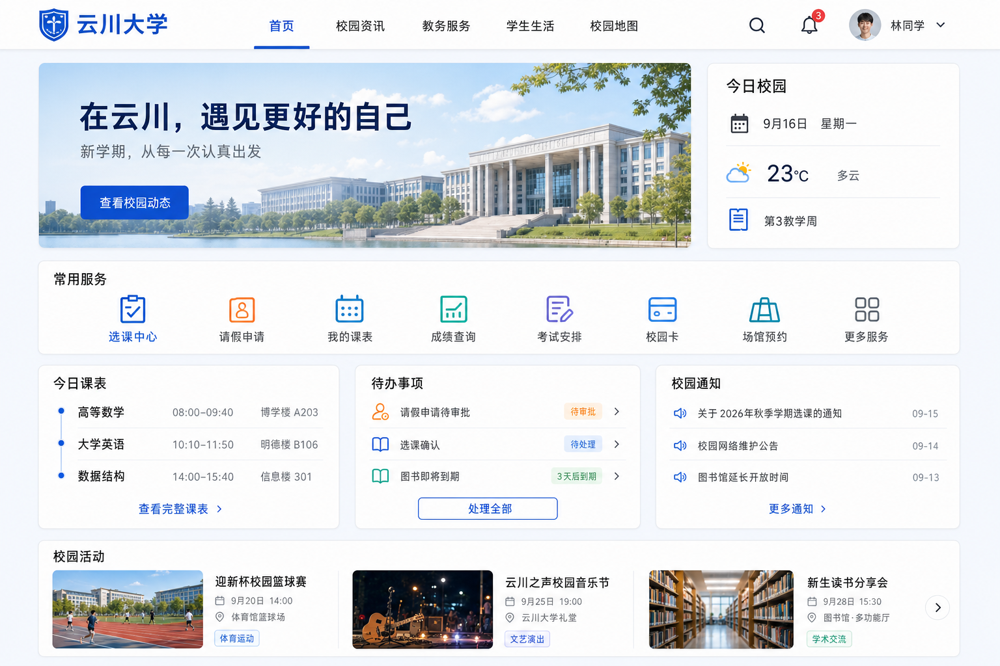

# 云川大学校园门户首页｜设计交付说明



## 1. 产品定位

这是一个面向在校学生的 Demo 级校园门户首页。页面同时承担三类任务：

1. 展示学校形象与校园动态；
2. 提供高频教务、生活服务入口；
3. 汇总学生当天的课程、待办和通知。

首页目标不是堆叠全部系统能力，而是让学生在 10 秒内完成“看课表、办事务、读通知”。

## 2. 页面结构

### 顶部导航

- 左侧：校徽占位图形 + `云川大学`。
- 主导航：`首页 / 校园资讯 / 教务服务 / 学生生活 / 校园地图`。
- 右侧：搜索、消息提醒、头像、`林同学`、下拉菜单。
- 当前导航使用蓝色文字和 3px 底部指示条。
- 吸顶显示，页面滚动后保留轻微阴影。

### 首屏区域

- 采用 3:1 左右分栏。
- 左侧为校园形象横幅：标题 `在云川，遇见更好的自己`，副标题 `新学期，从每一次认真出发`，主按钮 `查看校园动态`。
- 右侧为 `今日校园` 信息卡，展示日期、天气和教学周。
- 横幅图片需要加轻微白色遮罩，确保文字对比度。

### 常用服务

保持 8 个入口：

- 选课中心
- 请假申请
- 我的课表
- 成绩查询
- 考试安排
- 校园卡
- 场馆预约
- 更多服务

桌面端横向等分排列。默认只有图标和名称，悬停时卡片上浮 2px 并出现浅色背景；`选课中心` 使用主蓝色，`请假申请` 使用橙色，其他入口使用蓝、青、紫等克制的辅助色。

### 信息工作台

桌面端三列，卡片等高：

- `今日课表`：时间轴形式展示课程名、时间和地点，底部为 `查看完整课表`。
- `待办事项`：展示请假审批、选课确认、图书到期，使用 `待审批 / 待处理 / 3天后到期` 状态标签，底部为 `处理全部`。
- `校园通知`：三条通知及日期，底部为 `更多通知`。

### 校园活动

横向展示 3 张活动卡片：活动封面、标题、时间、地点和类型标签。支持左右切换，Demo 中只需实现静态数据与 hover 效果。

## 3. 视觉规范

| 项目 | 规范 |
| --- | --- |
| 页面背景 | `#F5F7FB` |
| 主色 | `#2457D6` |
| 深色标题 | `#18243A` |
| 辅助文本 | `#718096` |
| 青色辅助 | `#4BB6D8` |
| 橙色强调 | `#FF9E57` |
| 卡片背景 | `#FFFFFF` |
| 边框 | `#E6EAF0`，1px |
| 字体 | `Inter, PingFang SC, Microsoft YaHei, sans-serif` |
| 页面最大宽度 | 1320px |
| 页面左右留白 | 桌面 48px，平板 24px，手机 16px |
| 卡片圆角 | 16px |
| 按钮圆角 | 8px |
| 卡片阴影 | `0 6px 24px rgba(24, 36, 58, 0.06)` |
| 间距系统 | 8px 基准，常用 8 / 16 / 24 / 32px |

文字层级：

- Hero 标题：38–42px / 700。
- 页面模块标题：22px / 600。
- 卡片标题：18px / 600。
- 正文：14–16px / 400。
- 辅助信息：13–14px / 400。

## 4. 交互要求

- 所有按钮、服务入口、通知和活动卡片都应有明确 hover、focus 和 active 状态。
- 点击 `请假申请` 打开抽屉或模态框，包含请假类型、开始/结束时间、原因、证明附件和提交按钮。
- 点击 `选课中心` 进入 Demo 选课页或打开课程选择弹窗，至少能搜索课程、查看余量和切换“已选/可选”。
- 消息图标显示未读数字 3；点击后展开消息浮层。
- 学生头像下拉菜单包含 `个人中心 / 账号设置 / 退出登录`。
- 加载状态使用骨架屏；空数据使用简洁插画或图标加说明，不显示空白卡片。
- 表单提交用前端模拟，成功后使用 Toast 提示并更新对应待办状态。

## 5. 响应式规则

- `>= 1200px`：首屏左右分栏、服务入口 8 列、工作台 3 列。
- `768–1199px`：首屏仍分栏但比例改为 2:1；服务入口 4 列；工作台 2 列，通知卡独占下一行。
- `< 768px`：隐藏桌面导航，改为汉堡菜单；首屏单列；服务入口 4 列或 2 列；工作台和活动均单列；Hero 标题缩小至 28px。

## 6. 建议组件拆分

```text
CampusHomePage
├─ Header
│  ├─ MainNav
│  ├─ NotificationPopover
│  └─ UserMenu
├─ HeroBanner
├─ TodayCampusCard
├─ QuickServices
│  └─ ServiceItem × 8
├─ DashboardGrid
│  ├─ TodayScheduleCard
│  ├─ TodoCard
│  └─ NoticeCard
├─ CampusActivities
│  └─ ActivityCard × 3
├─ LeaveRequestModal
└─ CourseSelectionModal
```

## 7. 可直接复制给 GLM 的实现提示词

```text
请根据随附的 campus-homepage.png 高保真设计稿，实现一个可运行的中文大学学生门户首页。

技术建议：React + TypeScript + Vite + Tailwind CSS；图标使用 Lucide React。禁止把整张设计稿直接当背景图，必须按组件还原。所有数据使用本地 mock，不需要后端。

必须实现：
1. 顶部吸顶导航、校园 Hero、今日校园卡；
2. 8 个常用服务入口；
3. 今日课表、待办事项、校园通知；
4. 3 个校园活动卡片；
5. 点击“请假申请”打开可填写并提交的模态框；
6. 点击“选课中心”打开课程搜索与选择弹窗；
7. 消息气泡和用户下拉菜单；
8. 完整的 hover/focus/active 状态、Toast 反馈与基础无障碍属性；
9. 桌面、平板和手机响应式布局。

视觉规范：主色 #2457D6，背景 #F5F7FB，标题 #18243A，辅助文字 #718096，橙色 #FF9E57；卡片 16px 圆角、1px 浅边框、克制阴影；最大内容宽度 1320px；使用 8px 间距系统；中文字体优先 PingFang SC / Microsoft YaHei。

请把页面拆成可维护组件，不使用超大单文件；提供 mock 数据文件；保证 npm install 后可直接 npm run dev；完成后检查移动端没有横向滚动、所有交互可用、中文无乱码。
```

## 8. 验收清单

- 1440px 宽度下与设计稿的模块位置、比例和视觉层级基本一致。
- 选课、请假两个热门功能具备可操作 Demo，不是纯链接。
- 页面中没有 Lorem Ipsum、无效按钮或破图。
- 360px 手机宽度下没有横向滚动。
- Tab 键可以访问主要按钮和弹窗控件，焦点状态清晰。
- 颜色、圆角、字号和间距通过统一变量管理。
