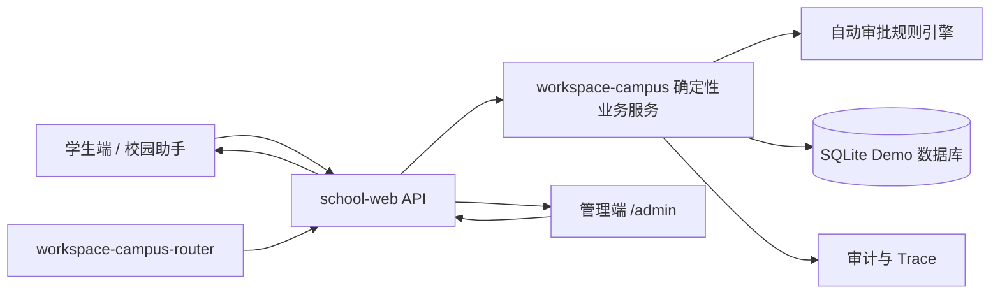
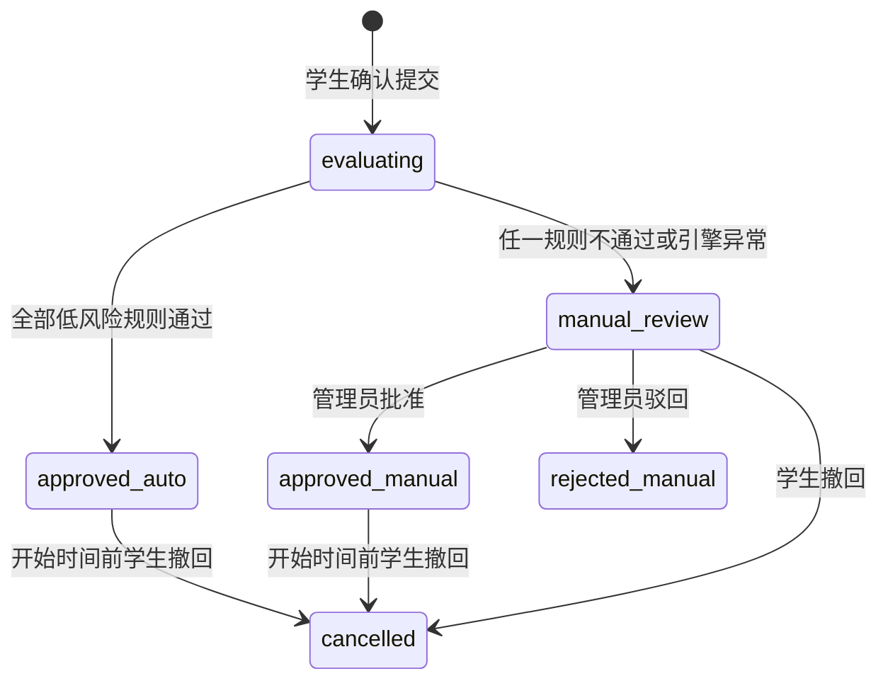

# 校园助手管理端与请假自动审批开发方案

> 文档状态：已确认，可进入开发
> 适用分支：三个核心仓库的 `dev` 分支
> 方案日期：2026-08-17
> 目标形态：本地 Demo，不对接真实学校业务系统

## 1. 已确认的产品决策

1. 本期只建设可完整演示的 Demo，不承担真实学校生产部署要求。
2. 低风险请假由规则引擎自动批准，其余申请进入人工复核；首版绝不自动驳回。
3. 管理端暂不划分校级、院系、辅导员等数据范围，只提供一个拥有全校数据权限的 `campus-admin` 角色。
4. 演示数据由外部模型批量生成，本方案给出固定数据结构、数量和质量约束。
5. 首版不上传、不存储、不识别附件，只处理请假类型、时间和原因。
6. 三个核心仓库均从 `main` 建立 `dev` 开发分支。

## 2. 建设目标

在现有学生端请假提交能力之上，补齐从学生申请、自动审批、人工处理到学生查询结果的完整链路，并增加一个可用于演示的学校管理端。

演示必须能够完整呈现以下两条路径：

- 低风险路径：学生确认提交 → 系统执行规则 → 自动批准 → 学生立即看到审批结果和命中依据。
- 人工路径：学生确认提交 → 系统执行规则 → 转人工复核 → 管理员查看详情并批准或驳回 → 学生看到最终结果。

同时提供学院、班级、学生、审批规则和请假记录的基础管理能力，以及可追溯的审批记录和操作审计。

## 3. 非目标

本期明确不做：

- 真实学校 SSO、教务系统、统一消息中心或真实学生数据接入；
- 多学校、多租户及分级数据权限；
- 辅导员、院系、学生工作处等多级审批流；
- 病历、诊断证明等附件上传和内容识别；
- 大模型直接决定批准或驳回；
- 短信、邮件、企业微信等外部通知；
- 移动端原生应用；
- 自动驳回、自动处分或考勤处罚。

## 4. 当前基础与需要修正的问题

### 4.1 已有基础

- 学生端已经具备请假表单、助手参数补全、提交前明确确认、查询和撤回能力。
- 请假能力已有幂等键、审计证据、执行状态、Trace 和安全角色校验。
- 服务端已有 `student`、`campus-operator`、`campus-auditor` 角色基础和 Demo、Token、OIDC 三种身份适配方式。
- 请假课程影响编排可以展示请假期间可能受影响的 Demo 课程。

### 4.2 当前缺口

- 请假记录使用 `data/leave-requests.json`，不适合管理端筛选、统计和多操作并发。
- 请假状态只有待审批和已取消，缺少自动审批、人工复核、批准和驳回状态。
- 没有管理端页面、管理员登录、审批 API 和规则配置。
- `workspace-campus` 中的请假入口曾实际转调 `<OPENCLAW_HOME>/workspace` 下的共享脚本，存在三个核心仓库之外的隐藏依赖。

开发时应把请假数据实现收回 `workspace-campus`，使三个核心仓库能够独立还原和运行 Demo。

## 5. 总体架构



核心原则：

- React 页面只通过服务端 API 访问数据，不能直接读写 SQLite。
- Node.js 服务端负责身份、权限、请求校验、幂等、审计编排和安全输出。
- Node.js/TypeScript 确定性服务负责数据库事务、审批规则计算和请假状态变更。
- 大模型和路由 Agent 只负责理解学生意图、收集参数及解释结果，不参与审批决策。
- 管理员按钮直接调用确定性 API，不经过 LLM 路由。

## 6. 三个仓库的职责

### 6.1 `<PROJECT_ROOT>/school-web`

负责管理端和统一 API：

- 增加 `/admin/login` 和 `/admin` 页面入口；
- 增加管理端布局、审批工作台、数据管理、规则配置、统计和审计页面；
- 增加 `campus-admin` 身份认证和权限中间件；
- 增加管理端 REST API；
- 扩展学生端请假结果卡片和审批状态展示；
- 调用 `workspace-campus` 中的确定性 TypeScript 服务；
- 增加 API、权限、状态机和前端组件测试。

### 6.2 `<OPENCLAW_HOME>/workspace-campus`

负责业务规则、数据和 OpenClaw Skill：

- 使用 Node.js 内置 `node:sqlite`（Node 22.13+，本机 24.x）建立 Demo 数据库，不增加外部数据库服务，也不引入 Python；
- 新增数据库初始化、迁移、演示数据导入和重置脚本；
- 将请假实现从隐藏的共享工作区迁回本仓库；
- 实现自动审批规则引擎、人工审批命令和统计查询；
- 扩展 `campus-leave` Skill，使学生能查询自动批准、人工复核、人工批准、人工驳回和撤回状态；
- 保留哈希链审计，并为每次规则评估保存结构化证据；
- 增加数据库、规则、事务、幂等和迁移测试。

建议目录：

```text
workspace-campus/
  campus-services/
    package.json               # 私有包，零运行时依赖，node 直接运行 .ts（Node 22.13+）
    tsconfig.json
    src/
      errors.ts
      db.ts                    # node:sqlite 连接、PRAGMA、迁移框架
      audit.ts                 # SQLite 哈希链审计
      approvalEngine.ts        # 规则引擎与版本管理
      leaveService.ts          # 请假状态机与事务
      adminService.ts          # 人工审批、统计、学校数据、规则、审计查询
      bin/
        leaveManagerCli.ts     # 学生端 CLI（create/list/cancel/verify-audit）
        campusAdminCli.ts      # 管理端 CLI（stdin JSON 命令）
        initDemoDb.ts
        importDemoSeed.ts
        migrateLeaveJson.ts
        generateSeed.ts
    test/                      # node:test 单元与事务测试
  demo/auto-approval/seed/
    school.json
    colleges.json
    classes.json
    students.json
    leave-requests.json
  data/
    campus-demo.sqlite3        # 运行时文件，不提交 Git
```

### 6.3 `<OPENCLAW_HOME>/workspace-campus-router`

负责学生自然语言意图路由，不承载管理端审批：

- 保持管理员审批操作不进入 LLM 路由；
- 补充“查询审批结果、为什么转人工、为什么自动通过”等学生意图示例；
- 确保这些查询仍路由到 `campus.leave`；
- 增加新审批状态相关的路由样例和评测用例；样例与评测实际维护在 `school-web` 的 `evals/`，本仓库仅在路由协议描述变化时同步更新 `AGENTS.md` 人设说明。

## 7. 管理端范围

### 7.1 管理员登录

Demo 增加独立的管理员登录页。账号和密码由服务端环境变量配置，仓库中不得提交默认明文密码。

建议配置：

```text
CAMPUS_DEMO_ADMIN_USERNAME=campus-admin
CAMPUS_DEMO_ADMIN_PASSWORD=<本地演示密码>
CAMPUS_DEMO_ADMIN_TOKEN_SECRET=<至少32字节随机值>
```

登录成功后签发短期访问令牌，包含 `campus-admin` 角色，默认有效期 2 小时。令牌只保存在页面内存中，刷新页面后重新登录。生产级账号体系不在本期范围。

### 7.2 管理端页面

| 页面 | 基本功能 |
| --- | --- |
| 总览 | 待人工数量、今日申请、自动批准率、人工批准/驳回数、近 7 天趋势 |
| 审批工作台 | 按状态、学院、班级、假别和日期筛选；分页；查看申请详情 |
| 申请详情 | 学生信息、请假时间、原因、课程影响、规则评估明细、历史请假、审批时间线 |
| 学校数据 | 编辑学校基础信息；学院、班级、学生的新增、编辑、停用和查询 |
| 审批规则 | 查看、启停和调整低风险规则；恢复默认规则；展示规则版本 |
| 审计记录 | 查看管理员操作、自动审批事件、操作者、时间、请求编号和结果 |
| Demo 工具 | 导入演示数据、重置数据库；必须二次确认并明确提示会清空运行数据 |

### 7.3 审批工作台操作

- 查看等待人工复核的申请；
- 单条人工批准；
- 单条人工驳回，驳回原因必填，长度 4～200 字；
- 批量批准，单次最多 50 条；
- 批量转为待处理不需要，因为未自动批准的申请默认已经进入人工队列；
- 已有最终结果不可重复审批；重复请求返回原结果，不产生第二次状态变更；
- 首版不提供批量驳回，避免误操作；
- 管理员可以查看全校全部申请和完整学号，但审计输出、Trace 和普通列表默认仍使用脱敏学号。

## 8. 请假状态机

数据库使用稳定英文状态码，界面使用中文标签。



| 状态码 | 中文标签 | 是否最终结果 | 说明 |
| --- | --- | --- | --- |
| `evaluating` | 审批中 | 否 | 短暂事务状态，对前端通常不可见 |
| `approved_auto` | 已自动批准 | 是 | 所有已启用低风险规则通过 |
| `manual_review` | 待人工复核 | 否 | 任一规则未通过或规则引擎保护性降级 |
| `approved_manual` | 已人工批准 | 是 | 管理员人工批准 |
| `rejected_manual` | 已人工驳回 | 是 | 仅管理员可产生，必须填写原因 |
| `cancelled` | 已撤回 | 是 | 学生在请假开始前撤回 |

兼容策略：迁移旧数据时，`pending` 映射为 `manual_review`，旧 `cancelled` 保持不变。API 暂时接受旧状态但只输出新状态。

## 9. 首版自动批准规则

规则引擎必须确定、可测试、可解释。同一份申请和同一规则版本必须产生相同结果。规则按“全部通过才自动批准”执行；任何一项不通过都只转人工，不自动驳回。

默认低风险规则如下：

| 规则编号 | 默认条件 | 未通过后的处理 |
| --- | --- | --- |
| `LEAVE_TYPE_ALLOWED` | 假别只能是病假或事假 | 转人工 |
| `REASON_COMPLETE` | 原因去除首尾空格后为 8～200 字，且不是纯重复字符或明显占位文本 | 转人工 |
| `FUTURE_REQUEST` | 开始时间晚于提交时间至少 2 小时 | 转人工 |
| `DATE_RANGE_ALLOWED` | 开始时间不晚于提交时间后 30 天 | 转人工 |
| `SAME_DAY` | 开始和结束位于同一自然日 | 转人工 |
| `DURATION_LIMIT` | 时长大于 0 且不超过 8 小时 | 转人工 |
| `NO_OVERLAP` | 与该学生未撤回、未驳回的请假不存在时间重叠 | 转人工 |
| `FREQUENCY_LIMIT` | 过去 30 天内已批准申请少于 3 次，累计批准时长加本次不超过 24 小时 | 转人工 |
| `STUDENT_ACTIVE` | 学生状态为在读且未停用 | 转人工 |

补充约束：

- 公假和其他类型默认进入人工复核。
- 课程冲突只展示为审批参考，不作为首版自动批准的否决条件。
- “明显占位文本”只使用固定、可配置的精确词表，例如“无”“不知道”“随便”“测试”；不得使用 LLM 判断原因是否真实。
- 规则引擎异常、数据库超时、规则配置缺失或版本不一致时必须保护性降级到 `manual_review`。
- 管理员可启停规则和修改阈值；每次修改生成新规则版本，历史审批继续引用当时版本。

每条规则输出：

```json
{
  "ruleCode": "DURATION_LIMIT",
  "passed": true,
  "actual": { "durationMinutes": 180 },
  "expected": { "maxMinutes": 480 },
  "message": "请假时长不超过 8 小时"
}
```

自动审批结果必须保存完整规则列表、规则版本、评估时间和最终动作，方便管理端和学生端解释“为什么自动批准”或“为什么转人工”。

## 10. 数据库方案

### 10.1 技术选择

Demo 使用 SQLite，数据库文件为：

```text
<OPENCLAW_HOME>/workspace-campus/data/campus-demo.sqlite3
```

Node 使用内置 `node:sqlite`，开启：

```sql
PRAGMA foreign_keys = ON;
PRAGMA journal_mode = WAL;
PRAGMA busy_timeout = 5000;
```

所有写操作使用显式事务。Schema 通过 `schema_migrations` 记录版本，不允许依靠运行时自动猜测字段。

### 10.2 核心数据表

#### `schools`

| 字段 | 类型 | 说明 |
| --- | --- | --- |
| `id` | TEXT PK | 学校编号，Demo 固定一个学校 |
| `name` | TEXT | 学校名称 |
| `timezone` | TEXT | 默认 `Asia/Shanghai` |
| `status` | TEXT | `active` / `inactive` |
| `created_at` / `updated_at` | TEXT | ISO 8601 时间 |

#### `colleges`

包含 `id`、`school_id`、`code`、`name`、`status`、`created_at`、`updated_at`，`code` 在学校内唯一。

#### `classes`

包含 `id`、`college_id`、`code`、`name`、`grade_year`、`major_name`、`status`、`created_at`、`updated_at`。

#### `students`

包含 `id`、`student_no`、`name`、`college_id`、`class_id`、`enrollment_year`、`status`、`created_at`、`updated_at`。`student_no` 唯一；`status` 为 `active`、`suspended` 或 `graduated`。

#### `leave_requests`

| 字段 | 类型 | 说明 |
| --- | --- | --- |
| `id` | TEXT PK | 保留 `LVYYYYMMDD-XXXXXX` 格式 |
| `student_id` | TEXT FK | 学生表主键 |
| `leave_type` | TEXT | `sick` / `personal` / `official` / `other` |
| `start_at` / `end_at` | TEXT | 带 `+08:00` 的 ISO 8601 时间 |
| `reason` | TEXT | 4～500 字，自动批准规则另要求 8～200 字 |
| `status` | TEXT | 状态机中的英文状态码 |
| `source` | TEXT | `campus-assistant` / `admin-import` / `seed` |
| `submitted_at` | TEXT | 学生确认提交时间 |
| `decided_at` | TEXT NULL | 最终批准或驳回时间 |
| `decision_mode` | TEXT NULL | `auto` / `manual` |
| `decision_reason` | TEXT NULL | 自动摘要或人工处理意见 |
| `rule_version` | INTEGER NULL | 自动评估使用的规则版本 |
| `created_at` / `updated_at` | TEXT | 记录时间 |
| `row_version` | INTEGER | 乐观并发版本，从 1 开始 |

索引：`student_id + submitted_at`、`status + submitted_at`、`college + status` 的查询路径必须有索引。学院和班级通过学生关联查询，不在申请表重复保存名称。

#### `leave_rule_evaluations`

每次自动评估一条记录，包含 `id`、`leave_request_id`、`rule_version`、`outcome`、`evaluated_at` 和 `error_code`。`outcome` 为 `approved_auto` 或 `manual_review`。

#### `leave_rule_results`

每条规则一条记录，包含 `evaluation_id`、`rule_code`、`passed`、`actual_json`、`expected_json`、`message` 和 `sequence`。

#### `leave_decisions`

保存不可变的审批时间线，包含 `id`、`leave_request_id`、`action`、`actor_type`、`actor_ref`、`actor_name`、`reason`、`from_status`、`to_status`、`request_id`、`idempotency_key_hash` 和 `created_at`。

#### `approval_rules`

包含 `id`、`rule_code`、`name`、`enabled`、`config_json`、`version`、`updated_by`、`created_at`、`updated_at`。同一次规则修改必须在一个事务内生成统一的新版本。

#### `audit_events`

保存管理端操作摘要，包含 `id`、`actor_ref`、`actor_role`、`action`、`resource_type`、`resource_id`、`outcome`、`request_id`、`details_json` 和 `created_at`。敏感字段不得写入 `details_json`。

#### `schema_migrations`

包含 `version`、`name`、`checksum` 和 `applied_at`。

### 10.3 数据迁移

提供一次性、可重复运行的 `migrate_leave_json.py`：

1. 初始化数据库和默认规则；
2. 读取现有 `data/leave-requests.json`；
3. 按学号匹配或创建学生；
4. `pending` 转为 `manual_review`，`cancelled` 保持不变；
5. 使用申请编号作为幂等键，已导入记录不重复插入；
6. 迁移前创建带时间戳的只读备份；
7. 输出导入、跳过和失败数量；
8. 迁移完成后，学生 Skill 和管理端统一读写 SQLite，不再双写 JSON。

## 11. API 设计

所有管理端接口要求 `campus-admin` 角色。写接口必须带 `x-request-id` 和 `idempotency-key`，返回统一错误码。

### 11.1 身份

| 方法 | 路径 | 用途 |
| --- | --- | --- |
| `POST` | `/api/campus-admin/auth/login` | Demo 管理员登录 |
| `GET` | `/api/campus-admin/session` | 获取管理员身份 |

### 11.2 概览与请假审批

| 方法 | 路径 | 用途 |
| --- | --- | --- |
| `GET` | `/api/campus-admin/dashboard` | 概览指标与趋势 |
| `GET` | `/api/campus-admin/leave-requests` | 筛选、排序、分页查询 |
| `GET` | `/api/campus-admin/leave-requests/{id}` | 详情、规则证据和审批时间线 |
| `POST` | `/api/campus-admin/leave-requests/{id}/approve` | 人工批准 |
| `POST` | `/api/campus-admin/leave-requests/{id}/reject` | 人工驳回 |
| `POST` | `/api/campus-admin/leave-requests/batch-approve` | 批量批准，最多 50 条 |

列表默认按 `submitted_at DESC` 排序。分页使用 `page`、`pageSize`，`pageSize` 最大 100。筛选条件包括状态、学院、班级、假别、关键字和起止日期。

### 11.3 学校数据

| 方法 | 路径 | 用途 |
| --- | --- | --- |
| `GET/PATCH` | `/api/campus-admin/school` | 学校信息读取和修改 |
| `GET/POST/PATCH` | `/api/campus-admin/colleges` | 学院查询、新增和修改 |
| `GET/POST/PATCH` | `/api/campus-admin/classes` | 班级查询、新增和修改 |
| `GET/POST/PATCH` | `/api/campus-admin/students` | 学生查询、新增和修改 |

存在历史请假关联的数据不物理删除，只允许停用。

### 11.4 规则与审计

| 方法 | 路径 | 用途 |
| --- | --- | --- |
| `GET` | `/api/campus-admin/approval-rules` | 读取当前规则和版本 |
| `PUT` | `/api/campus-admin/approval-rules` | 整体更新规则，生成新版本 |
| `POST` | `/api/campus-admin/approval-rules/reset` | 恢复默认规则 |
| `GET` | `/api/campus-admin/audit-events` | 查询管理操作审计 |
| `POST` | `/api/campus-admin/demo/reset` | 二次确认后重置演示数据库 |

### 11.5 学生端扩展

现有学生查询接口增加：

- 新状态码和中文标签；
- `decisionMode`、`decidedAt` 和安全的 `decisionSummary`；
- 自动审批时返回可展示的规则通过摘要；
- 人工驳回时返回管理员填写的驳回原因；
- 转人工时只说明待复核，不泄露风控阈值以外的其他学生信息。

学生只能读取和撤回自己的申请。撤回已批准申请仅允许发生在 `start_at` 之前。

## 12. 并发、幂等与失败处理

- 提交请假和执行自动审批必须在同一数据库事务中完成，前端不会长期看到 `evaluating`。
- 人工审批使用 `row_version` 做乐观并发控制；状态或版本不一致返回 `409 LEAVE_ALREADY_DECIDED`。
- 相同身份、操作、资源和幂等键返回首次结果；相同幂等键搭配不同请求体返回冲突。
- 批量批准逐条返回结果，不因一条已处理而回滚其他合法申请。
- 规则引擎异常时申请必须落入 `manual_review`，不得丢失申请，也不得声称已批准。
- 数据库事务失败时学生端明确显示“尚未提交成功”，不能生成虚假申请编号。
- Demo 重置操作必须使用独立确认短语，并写入审计。

## 13. 演示数据生成要求

请让 GLM 生成 UTF-8 JSON，只生成虚构信息，不使用真实学校、真实学号、真实手机号或可识别个人信息。

### 13.1 文件与数量

输出到 `workspace-campus/demo/auto-approval/seed/`：

| 文件 | 数量 | 要求 |
| --- | ---: | --- |
| `school.json` | 1 所 | 使用现有“云川大学”Demo 名称，时区为 `Asia/Shanghai` |
| `colleges.json` | 6 个 | 编号唯一，覆盖理工、人文、经管等方向 |
| `classes.json` | 24 个 | 每学院 4 个班，覆盖 2023～2026 四个年级 |
| `students.json` | 480 人 | 每班 20 人；学号唯一；姓名使用“林同学、周同学”式演示称呼 |
| `leave-requests.json` | 600 条 | 覆盖最近 90 天和未来 30 天，关联已有学生 |

### 13.2 请假数据分布

- 假别：病假 45%、事假 35%、公假 10%、其他 10%；
- 目标状态：自动批准 35%、待人工 25%、人工批准 20%、人工驳回 10%、已撤回 10%；
- 时长同时包含 1～4 小时、4～8 小时、跨日和超过 8 小时；
- 至少 40 组时间重叠申请，用于验证转人工规则；
- 至少 40 名学生在 30 天内有 3 次以上请假，用于验证频次规则；
- 至少 50 条申请距离开始不足 2 小时；
- 原因长度主要为 8～60 字，并包含少量“无”“测试”等占位原因；
- 自动批准样本必须只使用病假或事假、同日不超过 8 小时、提前至少 2 小时、无重叠且频次未超限；
- `rejected_manual` 必须有 4～80 字人工驳回原因；
- 所有时间为带 `+08:00` 的 ISO 8601 字符串；
- 所有外键必须有效，不允许重复主键、悬空班级或不存在的学生；
- 数据生成脚本导入前还会重新运行规则引擎，若声明状态与计算证据矛盾则拒绝导入。

### 13.3 GLM 可直接使用的生成任务

```text
为“云川大学”智能校园助手 Demo 生成五个互相关联的 UTF-8 JSON 文件：
school.json、colleges.json、classes.json、students.json、leave-requests.json。
必须严格遵守开发文档第 13 节的数量、比例、主外键、时间格式和状态一致性要求。
所有学校内容和人员信息均为虚构演示数据；学生姓名使用“X同学”形式，不生成身份证号、手机号、住址、病历或真实个人信息。
先输出每个文件的 JSON Schema，再分文件输出完整 JSON。不要输出注释，不要省略数组元素，不要使用省略号。
```

实际接收 GLM 输出时，应先保存到临时目录，执行 schema、外键、比例和规则一致性校验，通过后再复制到种子目录，不能直接覆盖运行数据库。

## 14. 安全与隐私

- 管理 API 默认拒绝 `student`、`campus-operator` 和未登录身份，只允许 `campus-admin`。
- 管理员密码只从环境变量读取，服务端只比较，不写入数据库、日志或响应。
- 登录失败响应不区分账号不存在和密码错误，并增加短时速率限制。
- 请假原因属于受限业务信息：只在申请详情中展示，Trace、普通审计摘要和错误日志不记录正文。
- 列表页默认展示脱敏学号；详情页在最高权限下可查看完整学号，并记录一次 `leave.view-detail` 审计事件。
- 数据库、备份、运行日志和管理员密钥继续由 `.gitignore` 排除。
- 所有页面输出按文本渲染，禁止将请假原因作为 HTML 注入。

## 15. 测试与评测

### 15.1 规则测试

- 每条默认规则分别覆盖通过、边界值和不通过；
- 8 小时、30 天、2 小时、3 次和 24 小时累计等边界必须单独测试；
- 任意规则失败都进入人工复核；
- 公假和其他类型永不自动批准；
- 引擎异常保护性降级；
- 同一输入和规则版本结果稳定。

### 15.2 数据与事务测试

- JSON 迁移可重复运行且不会重复导入；
- 外键、唯一索引、状态约束生效；
- 学生提交、规则评估和审批证据原子提交；
- 两个管理员同时审批只有一个成功；
- 幂等重放和请求体冲突；
- 审计链校验和敏感内容不落日志。

### 15.3 API 与权限测试

- 未登录、学生、旧操作员访问管理 API 均返回 401/403；
- 管理员列表、详情、批准、驳回、批量批准和规则修改正常；
- 驳回原因缺失、非法筛选、超大分页和超过 50 条批量请求被拒绝；
- 学生不能查看他人申请或管理员审计；
- 已批准申请在开始时间后不能撤回。

### 15.4 前端验收测试

- 管理员登录、退出和令牌过期；
- 工作台筛选、分页、空状态、加载状态和错误恢复；
- 申请详情展示自动规则证据和审批时间线；
- 人工批准、驳回、批量批准都有二次确认和成功反馈；
- 数据管理表单校验和停用确认；
- 学生提交后能立即看到自动批准或待人工状态；
- 管理员处理后学生查询得到最终结果。

### 15.5 OpenClaw 路由评测

新增至少以下语义样例：

- “我的请假批下来了吗”；
- “为什么这次是自动通过的”；
- “为什么需要人工审核”；
- “查询我最近的请假审批结果”；
- “管理员帮我直接批准”必须仍受服务端角色限制，学生消息不能越权。

## 16. 开发阶段与顺序

### 阶段一：数据层和审批引擎

1. 在 `workspace-campus` 建立 SQLite Schema 和迁移框架；
2. 迁回请假共享实现，消除第四工作区依赖；
3. 实现默认规则、状态机、审批证据和人工审批命令；
4. 迁移旧 JSON 数据并完成 campus-services 单元测试。

完成标准：命令行可演示自动批准、转人工、人工批准、人工驳回、撤回和查询全流程。

### 阶段二：服务端管理 API

1. 在 `school-web` 增加 Demo 管理员认证；
2. 实现管理端查询、审批、规则、学校数据、统计和审计 API；
3. 接入现有幂等、Trace、错误协议和权限体系；
4. 完成 API 和并发测试。

完成标准：不依赖前端即可通过 API 跑通两条核心审批路径。

### 阶段三：管理端界面

1. 增加登录、布局、总览和审批工作台；
2. 增加详情、审批操作、规则配置和数据管理；
3. 增加审计与 Demo 重置工具；
4. 补齐响应式布局、空状态、错误状态和交互测试。

完成标准：管理员可在浏览器中完成全部首期操作。

### 阶段四：学生链路与路由对齐

1. 扩展学生端状态和结果卡片；
2. 更新 `campus-leave` Skill 文档、输出和查询结果；
3. 更新 Router 示例和评测；
4. 使用完整种子数据进行端到端演示。

完成标准：学生提交、系统审批、管理员处理、学生查询形成闭环。

## 17. Demo 验收脚本

正式演示按以下顺序准备：

1. 重置并导入演示数据；
2. 学生 A 提交同日 3 小时病假，信息完整且频次正常，立即显示“已自动批准”；
3. 展开结果卡片，展示规则版本和全部通过项；
4. 学生 B 提交跨日事假，显示“待人工复核”，不出现驳回结论；
5. 管理员登录 `/admin`，总览待办数增加；
6. 管理员打开学生 B 详情，看到 `SAME_DAY` 和 `DURATION_LIMIT` 未通过；
7. 管理员填写意见并批准；
8. 学生 B 查询审批结果，显示“已人工批准”和意见；
9. 学生 C 提交公假，管理员人工驳回并填写原因；
10. 学生 C 查询到人工驳回原因；
11. 管理员查看审计时间线，能够对应上述操作且看不到访问令牌或完整原因正文日志；
12. 重复点击审批不会产生第二次决定。

## 18. 完成定义

满足以下条件才视为本功能完成：

- 三个仓库的实现和文档均位于 `dev` 分支；
- 三个核心仓库可以独立还原 Demo，不依赖 `<OPENCLAW_HOME>/workspace` 下的隐藏请假实现；
- SQLite Schema、迁移、种子导入、备份和重置均可重复执行；
- 自动批准只发生在全部低风险规则通过时；
- 任何不确定或异常都进入人工复核，代码中不存在自动驳回路径；
- 管理端具备全校数据管理、请假处理、规则配置、统计和审计基本能力；
- 学生只能操作和查看自己的申请；
- API、规则、权限、并发和端到端测试全部通过；
- `npm test`、前端构建、campus-services 测试（`node --test`）和路由评测全部通过；
- README 和 `.env.example` 包含启动、初始化数据和管理员登录说明；
- 演示脚本可以稳定复现自动批准与人工处理两条完整链路。

## 19. 分支与提交建议

- 三个仓库均使用本地 `dev` 分支开发；首次推送时建立各自的 `origin/dev`，不要让本地 `dev` 长期跟踪 `origin/main`。
- 每个阶段按仓库拆分小提交，避免把数据库、API 和 UI 混成一个不可审查提交。
- 推荐提交顺序：Schema → 数据服务 → 规则引擎 → API → 管理端 UI → 学生端适配 → 路由评测 → 文档与 Demo。
- 在所有测试通过前不合并回 `main`。

## 20. 实施补充约定（2026-08-17 现状核查后）

以下约定是对前文的实施级细化，基于三个仓库现状核查得出，不改变已确认的产品决策。

### 20.0 实施语言决策

- 确定性业务服务（数据库、规则引擎、请假状态机、管理服务）全部使用 TypeScript 实现，运行于 Node.js 内置 `node:sqlite`（本机 Node 24.x；Node 22.13+ 均可），零外部依赖、零构建步骤（`node` 直接运行 `.ts`）。
- 本功能范围内不再新增 Python 代码；既有 `campus-course`、`campus-knowledge` 等 Python Skill 维持现状，不在本期迁移范围。
- `campus-services` 为 `workspace-campus` 内的私有 npm 包：`npm test` 使用 Node 内置 `node --test`。

### 20.1 确定性服务调用契约

- 确定性服务保持既有 Skill 传输模式：Node 通过 `execFile` 调用 TypeScript CLI 子命令，参数经命令行与环境变量传入，结果以 stdout 单行 JSON 返回；退出码沿用 `0` 成功、`2` 业务错误、`1` 内部错误。
- 数据库路径使用环境变量 `CAMPUS_DB_FILE`，默认 `<workspace-campus>/data/campus-demo.sqlite3`。
- 管理端统一入口为 `campus-services/src/bin/campusAdminCli.ts <command>`，从 stdin 读取 JSON 参数；学生端使用 `campus-services/src/bin/leaveManagerCli.ts` 的 `create/list/cancel/verify-audit` 子命令。

### 20.2 campus-leave 兼容与切换

- `leaveManagerCli.ts` 必须保持子命令、参数旗标（`--student-id/--student-name/--college/--class-name/--leave-type/--start/--end/--reason` 等）、`LVYYYYMMDD-XXXXXX` 编号、`CAMPUS_IDEMPOTENCY_KEY`/`CAMPUS_REQUEST_ID` 环境变量契约、同键重放与内容级去重语义，使 `school-web` 仅需把解释器从 Python 换成 Node 即可继续提交与撤回。
- `skills/campus-leave/scripts/leave_manager.py`（共享工作区转发 shim）在阶段一删除，`SKILL.md` 与 `capability.json` 改为指向新的 Node CLI；`school-web` 中直接读取 `leave-requests.json` 的学生列表端点（`listLeaveRequests`）在阶段二切换为调用确定性服务，不引入 JSON 与 SQLite 双写。

### 20.3 时间与确定性

- 新增 `CAMPUS_NOW` 环境变量注入时钟（沿用 `CAMPUS_COURSE_NOW` 先例），供测试与演示冻结时间。
- 规则评估基准时间：实时提交使用当前时间；种子导入复核使用记录自身的 `submitted_at`。

### 20.4 数据模型补充

- Demo 中 `students.id` 直接使用学号（`id == student_no`），简化外部映射。
- `leave_requests` 在第 10.2 节字段基础上增加 `idempotency_key_hash`（唯一索引，保持既有幂等契约）与 `emergency_contact_json`（保持既有表单契约）两列。
- 哈希链审计迁入 SQLite：`audit_events` 增加 `previous_hash`、`hash`、`integrity_mode`、`canonical_json` 字段，成为确定性服务侧唯一审计存储；迁移时把 `data/audit/leave.jsonl` 既有事件按原始哈希作为链前缀导入。Node 侧 `campus-api` 审计账本维持现状。
- 规则版本采用全局统一版本号：任一规则修改使全部规则行在同一事务内升到同一新版本，评估时快照整组规则。
- 内容级去重保持既有语义：同一学生同一时段同一原因且未撤回的申请，再次提交返回原记录并标记 `duplicate`。

### 20.5 前端与管理员会话

- 不引入路由库：以 `window.location.pathname` 区分学生端与 `/admin`；`standalone.ts` 为非 API 路径增加 SPA fallback（vite dev 默认已支持）。
- 管理员令牌复用 `security.ts` 的 HMAC 令牌签发，roles 为 `['campus-admin']`；`CAMPUS_DEMO_ADMIN_TOKEN_SECRET` 未设置时回落 `CAMPUS_AUTH_SECRET`。

### 20.6 种子数据生成方式

- 由 GLM 产出内容素材（学院、专业、班级、学生称呼、请假原因语料和分布参数），仓库内提供确定性脚本 `scripts/generate_seed.py` 装配出第 13 节要求的五个 JSON，并在装配过程中调用真实规则引擎判定自动批准样本，保证声明状态与评估证据一致；不手工编写 600 条记录。

### 20.7 既有资产处置

- 现存 4 条 `leave-requests.json` 记录按第 10.3 节迁移，迁移前生成带时间戳备份。
- `tests/test_evidence.py` 的请假场景（创建幂等、撤回幂等、审计链校验）移植到面向 SQLite 的新测试后移除旧文件；选课场景保留。
- `demo/campus-e2e` 中 `OPENCLAW_HOME` 指向共享工作区的设置在阶段一完成后一并清理。

### 20.8 分支

- `workspace-campus` 当前本地 `dev` 跟踪 `origin/main`；首次推送时执行 `git push -u origin dev` 建立正确上游，随后解除对 `origin/main` 的跟踪。

## 21. Agent 责任拆分（2026-08-19 修订）

原实现中学生提交与自动评估在同一调用内完成，不符合“学生 Agent 提交、管理员 Agent 批复”的产品边界。实施修订为：

1. `campus` 仍是学生端 Agent，只负责身份下的参数收集、明确确认和申请入库。
2. 入库事务只持久化 `leave_requests.status=evaluating` 与 `leave_approval_jobs.status=queued`，不执行规则。
3. 新增私有 OpenClaw `campus-admin` Agent，使用独立工作区、身份、会话和 `campus-auto-approval` Skill，不定义学生通道绑定。
4. 管理员 Agent 监听器扫描队列后启动专属 Skill。Skill 运行 9 条确定性规则，回写证据、决策时间线和 `approved_auto` / `manual_review`；决策 actor 固定为 `agent:campus-admin`。
5. 自动批复默认直接执行 Agent 专属确定性 Skill，LLM 只用于管理员助手对话和结果解释，不是审批决策者。
6. `/admin/assistant` 必须在管理员登录后才能访问，界面沿用学生校园助手的视觉系统，但 API 和 Agent 会话完全隔离。
